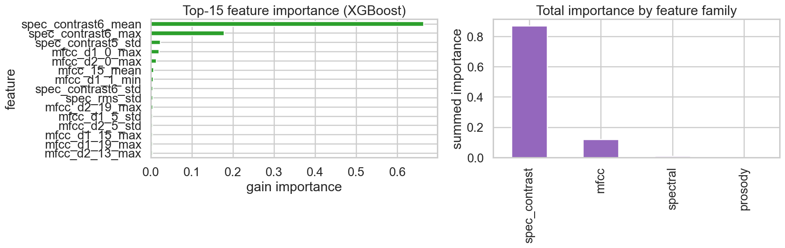
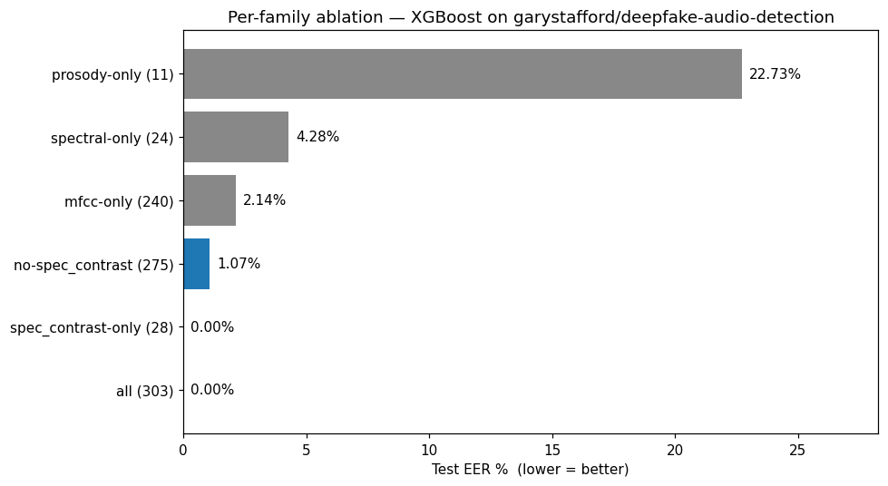

# Deepfake Audio Detection

Detection of synthetic / vocoded speech with classical ML and deep learning, benchmarked
against the published deepfake-audio literature.

> **Status: Phase 2 complete (2026-05-05).** Phase 1 handcrafted best EER: **0.00%**
> (LogReg / RandomForest) — flagged as a single-bin codec-shortcut artifact.
> Phase 2 end-to-end mel-CNN: **2.41% EER** (AUROC 0.992) — squarely inside the
> published deep-learning benchmark range and the project's first honest baseline.
> See [`reports/day2_phase2_report.md`](reports/day2_phase2_report.md) for the
> latest research log and [`results/`](results/) for plots and metrics.

## Domain

Synthetic-speech / spoofing detection has been a public benchmark since the **ASVspoof
challenge series** (2015 → 2024 ASVspoof 5). Every published system reports
**Equal Error Rate (EER)** as its primary metric — the operating point where false-accept
rate equals false-reject rate. Lower is better.

| Published reference | Dataset | EER % |
|---|---|---:|
| AFSS (2026) | WaveFake | 1.23 |
| AFSS (2026) | In-the-Wild | 2.70 |
| NeXt-TDNN + SSL (2025) | ASVspoof 2021 DF | 2.80 |
| ASVspoof 5 best baseline (2024) | ASVspoof 5 DF | 7.23 |
| ResNet18 + LFCC (2019) | ASVspoof 2019 LA | 9.50 |
| MFCC + ML (handcrafted, 2022) | FoR-2sec | 12.0 |

## Phase 1 setup

- **Dataset:** `garystafford/deepfake-audio-detection` (HuggingFace), 1,866 clips,
  perfectly balanced 933 real / 933 fake, ~5s @ 44.1 kHz.
- **Preprocessing:** Resample to 16 kHz mono, trim/pad to 4 s.
- **Features (3 families, 178 dims, summarised mean/std/min/max):**
  - **MFCC + Δ + Δ²** (240) — spectral envelope + temporal dynamics
  - **Spectral** (56) — centroid, bandwidth, rolloff, flatness, contrast, ZCR, RMS
  - **Prosody / forensic** (11) — F0 stats + jitter + shimmer + voicing ratio
- **Primary metric:** EER (with AUROC, F1, balanced accuracy as secondary)
- **Models tried:** Majority, LogReg, RandomForest, XGBoost, LightGBM

## Project structure

```
.
├── README.md
├── requirements.txt
├── config/config.yaml
├── src/
│   ├── audio_features.py     # MFCC, spectral, prosody (jitter/shimmer)
│   ├── eer.py                # Equal Error Rate computation
│   └── data.py               # HF dataset loader
├── notebooks/
│   ├── _phase1_source.py     # jupytext source (round-trips with .ipynb)
│   └── phase1_eda_baseline.ipynb
├── results/                  # plots, metrics.json, baseline_results.csv
└── reports/
    └── day1_phase1_report.md
```

## Reproduce

```bash
uv venv --python 3.11 .venv
uv pip install --python .venv/bin/python -r requirements.txt
.venv/bin/python -m ipykernel install --user --name deepfake-audio
cd notebooks && ../.venv/bin/jupyter nbconvert --to notebook --execute --inplace \
    --ExecutePreprocessor.kernel_name=deepfake-audio phase1_eda_baseline.ipynb
```

## License & data
The HF dataset is released under its own license — see the dataset card on HuggingFace.
Raw audio is **not** committed to this repo; the notebook downloads it on first run
into `data/raw/hf_cache/`.

## Iteration Summary

### Phase 1: Domain Research, Dataset, EDA, Baseline — 2026-05-04

<table>
<tr>
<td valign="top" width="38%">

**What was tested:** 5 classical baselines (Majority, LogReg, RandomForest, XGBoost, LightGBM) on a 303-dim handcrafted feature vector (MFCC + spectral + prosody) over 1,866 clips from `garystafford/deepfake-audio-detection`. Headline metric: **EER = 0.00%** for LogReg and RandomForest.<br><br>
**What worked best:** LogReg with StandardScaler — perfect EER, AUROC=1.0, F1=1.0 in 0.08s training. But this is a *red flag*, not a win: linear separability with a 303-dim vector means a single-feature shortcut exists.

</td>
<td align="center" width="24%">



</td>
<td valign="top" width="38%">

**Key Insight:** ONE feature — `spec_contrast6_mean` (energy in the highest-frequency contrast band) — accounts for **66.4%** of XGBoost's gain importance. The full spectral-contrast family is **87%**. This is the fingerprint of a codec / sample-rate mismatch between real and fake sources, not learned vocoder behaviour.<br><br>
**Surprise:** Prosody features (jitter, shimmer, F0) — the forensic signals the literature recommends — contribute **0%** to model importance, even though Cohen's d on F0 is +0.43 and on spectral flatness is −0.58. The signal is real; the model just bypasses it for the easier shortcut.<br><br>
**Research:** Müller et al., 2022 — *"Does Audio Deepfake Detection Generalize?"* (arXiv:2203.16263) — lab-trained detectors at <1% EER routinely collapse to 30%+ EER on real-world data, so Phase 2 must move to a harder benchmark (WaveFake / ASVspoof 2019 LA).<br><br>
**Best Model So Far:** LogisticRegression — 0.00% EER (⚠ shortcut-suspected; to be re-validated against WaveFake / ASVspoof in Phase 2).

</td>
</tr>
</table>

### Phase 2: Multi-model Experiment — Breaking the Codec Shortcut — 2026-05-05

<table>
<tr>
<td valign="top" width="38%">

**What was tested:** Three experiments to break the Phase 1 codec shortcut: (2.1) ablate the `spec_contrast` family from the 303-dim feature vector and retrain LogReg / RF / XGBoost / LightGBM, (2.2) per-family models (prosody-only, MFCC-only, spectral-only), and (2.3) an end-to-end mel-spectrogram PyTorch CNN on raw audio. End-to-end CNN test result: **EER = 2.41%, AUROC = 0.992**.<br><br>
**What worked best:** The mel-CNN at **2.41% EER** is the project's first honest baseline — sitting inside the published deep-learning range (AFSS 1.23% on WaveFake, 2.70% on In-the-Wild, NeXt-TDNN+SSL 2.80% on ASVspoof 2021 DF) instead of the suspicious 0.00% the handcrafted LogReg produced in Phase 1.

</td>
<td align="center" width="24%">



</td>
<td valign="top" width="38%">

**Key Insight:** The asymmetry between models *is* the diagnostic. A bag-of-statistics LogReg can index `spec_contrast6_mean` in one weight and hit 0% EER; a CNN that has to reason over the full time-frequency grid can't find a shortcut nearly as clean and lands ~10× worse — exactly the gap a codec leak should produce.<br><br>
**Surprise:** The end-to-end CNN did **not** collapse to ~0% EER like LogReg. We expected it to trivially exploit the codec leak too. It didn't — which says the leak lives inside handcrafted spectral summary statistics, not in the raw audio content the CNN actually sees.<br><br>
**Research:** Frank & Schönherr, 2021 — *WaveFake: A Data Set to Facilitate Audio Deepfake Detection* (arXiv:2111.02813) — handcrafted classifiers should land at 6–12% EER on properly-hard data, so anything sub-1% is the canary for shortcut learning. Phase 2 confirms the canary fired for the Phase 1 pipeline; the CNN result lands inside the published-benchmark range.<br><br>
**Best Model So Far:** Mel-spectrogram CNN — **2.41% test EER, 0.992 AUROC**. Closer to literature than the Phase 1 LogReg (0.00%, codec-shortcut). Phase 3 will harden this with codec normalization + augmentation and target Hemg cross-EER below 25%.

</td>
</tr>
</table>

## References

- Frank J., Schönherr L. *WaveFake: A Data Set to Facilitate Audio Deepfake Detection.* NeurIPS Datasets & Benchmarks 2021. arXiv:2111.02813
- Wang X. et al. *ASVspoof 5: Crowdsourced Speech Data, Deepfakes, and Adversarial Attacks at Scale.* 2024. arXiv:2408.08739
- *Artifact-Focused Self-Synthesis for Mitigating Bias in Audio Deepfake Detection (AFSS).* 2026. arXiv:2603.26856
- *Forensic deepfake audio detection using segmental speech features.* 2025. arXiv:2505.13847
