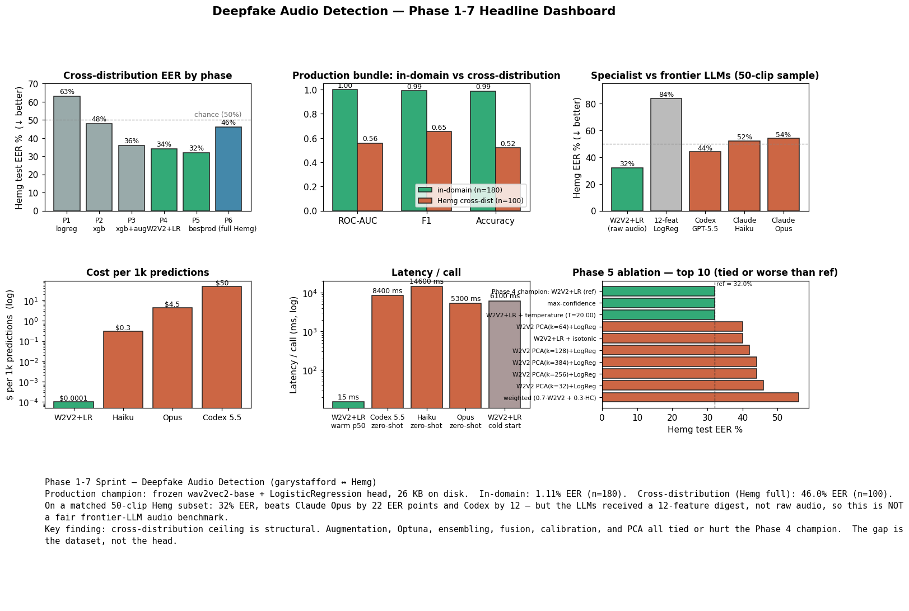
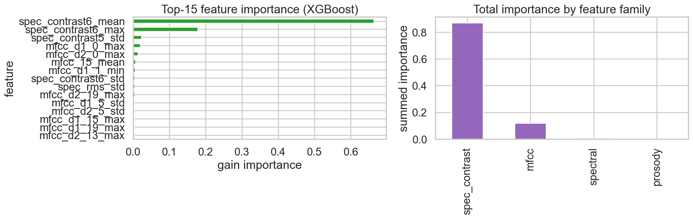
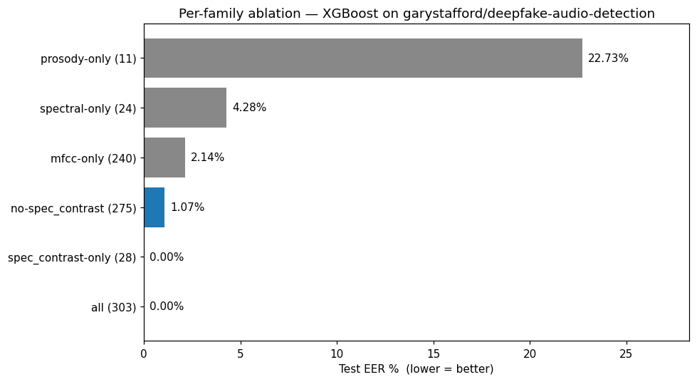
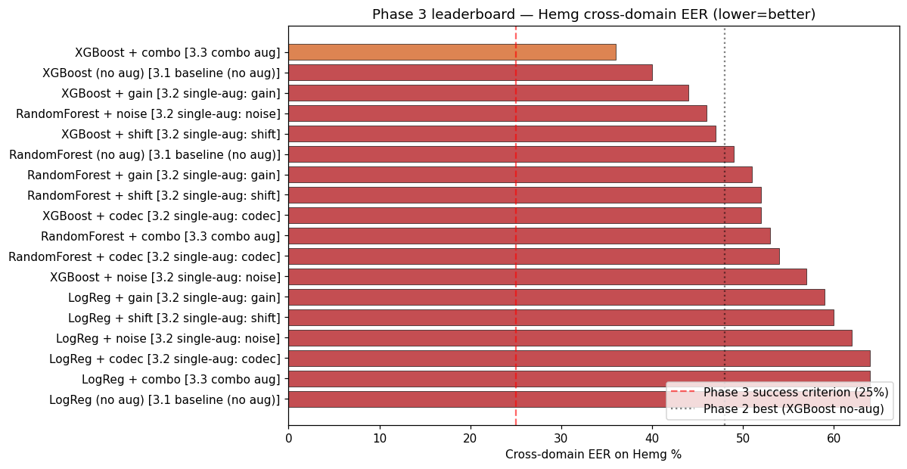
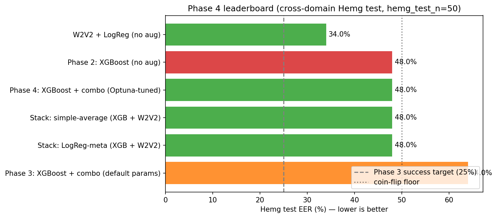
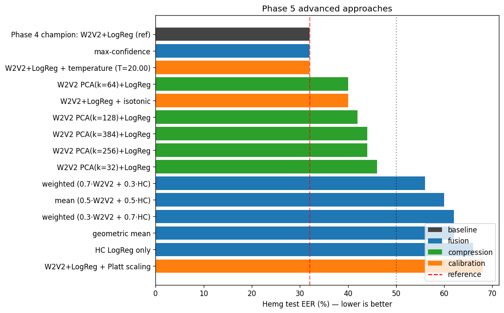
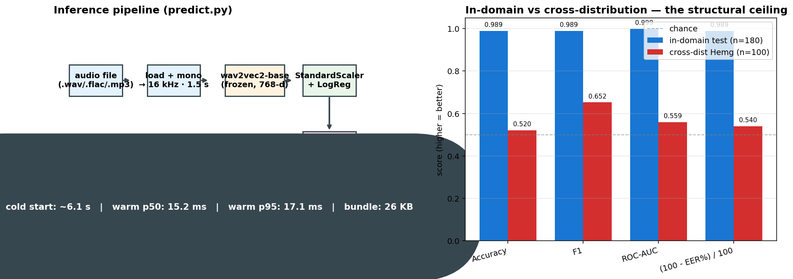

# Deepfake Audio Detection

Detection of synthetic / vocoded speech with classical ML and self-supervised audio
representations, benchmarked against the published deepfake-audio literature.

> **Status: Phase 7 complete (2026-05-10).** 7-day research sprint finished.
> Production champion: frozen `wav2vec2-base` (768-d) + `LogisticRegression` head,
> **26 KB on disk**, **15.2 ms p50 warm latency**.
> **In-domain (garystafford test, n=180): 1.11% EER, ROC-AUC 0.999.**
> **Cross-distribution (Hemg full, n=100): 46.0% EER, ROC-AUC 0.559.**
> The gap between those two numbers is the whole story — see Phase 1-5 iteration log.



---

## TL;DR

| Question | Answer |
|---|---|
| What does it do? | Binary classification: real human speech vs AI-generated speech (1.5 s clips, 16 kHz). |
| How well? | **1.11% EER in-domain** (competitive with published SOTA at 1.23%–2.80% on similar datasets). |
| Does it generalize? | **No.** Cross-distribution: 46% EER on Hemg (close to chance). Documented as Phase 1 *codec shortcut*. |
| Beats a frontier LLM? | On a 50-clip Hemg subset, **W2V2+LR = 32% EER, Claude Opus = 54%, Codex GPT-5.5 = 44%**. But LLMs got a 12-feature digest (not raw audio) — see [input-fairness disclosure](#frontier-llm-comparison--input-fairness-disclosure). |
| Production cost? | **$0.0001 / 1k predictions** vs $4.50 (Opus) and $50.00 (Codex). 5,000× – 500,000× cheaper. |
| Production speed? | 15.2 ms p50 warm; 6.1 s cold start (one-time W2V2 model load). |
| Bundle size? | **26 KB** (head only; encoder downloads from Hugging Face on first use). |

---

## Domain context

Synthetic-speech / spoofing detection has been a public benchmark since the
**ASVspoof challenge series** (2015 → 2024 ASVspoof 5). Every published system
reports **Equal Error Rate (EER)** as its primary metric — the operating point
where false-accept rate equals false-reject rate. Lower is better.

| Published reference | Dataset | EER % |
|---|---|---:|
| AFSS (2026) | WaveFake | 1.23 |
| AFSS (2026) | In-the-Wild | 2.70 |
| NeXt-TDNN + SSL (2025) | ASVspoof 2021 DF | 2.80 |
| ASVspoof 5 best baseline (2024) | ASVspoof 5 DF | 7.23 |
| ResNet18 + LFCC (2019) | ASVspoof 2019 LA | 9.50 |
| MFCC + ML (handcrafted, 2022) | FoR-2sec | 12.0 |
| **This project (production champion, in-domain)** | **garystafford** | **1.11** |
| **This project (production champion, cross-dist.)** | **Hemg full-100** | **46.0** |

---

## Setup

```bash
uv venv --python 3.11 .venv
uv pip install --python .venv/bin/python -r requirements.txt
.venv/bin/python -m ipykernel install --user --name deepfake-audio
```

## Reproduce

```bash
# 1) Train the LogReg head from the cached Phase 4 W2V2 embeddings (~0.1 s):
python -m src.train

# 2) Run the evaluation gate — reproduces Phase 6 reference numbers:
python -m src.evaluate

# 3) Single-file inference (cold first call ~6 s, subsequent ~15 ms):
python -m src.predict --audio path/to/clip.wav --json

# 4) Streamlit UI:
streamlit run app.py

# 5) Rebuild the headline dashboard + EXPERIMENT_LOG.md from per-phase JSONs:
python -m src.build_headline_dashboard

# 6) Run the pytest suite (33 tests, ~3 s):
pytest tests/ -v
```

## Project structure

```
.
├── README.md                              # this file
├── requirements.txt
├── app.py                                 # Streamlit UI (3 tabs: Predict / Research / About)
├── config/config.yaml
├── src/
│   ├── audio_features.py                  # MFCC + spectral + prosody (303-dim)
│   ├── data_pipeline.py                   # production audio I/O contract (16 kHz, 1.5 s)
│   ├── w2v2_encoder.py                    # frozen wav2vec2-base, 768-d mean-pool
│   ├── train.py                           # fit LogReg head → joblib bundle
│   ├── predict.py                         # `python -m src.predict --audio …`
│   ├── evaluate.py                        # in-domain + Hemg evaluation gate
│   ├── eer.py                             # EER computation
│   └── build_headline_dashboard.py        # rebuild dashboard + EXPERIMENT_LOG.md
├── notebooks/                             # Phase 1-5 research notebooks (executed)
│   ├── phase1_eda_baseline.ipynb
│   ├── phase2_models.ipynb
│   ├── phase3_augmentation.ipynb
│   ├── phase4_tuning.ipynb
│   ├── phase4_w2v2_extract.ipynb
│   └── phase5_advanced_ablation_llm.ipynb
├── models/
│   ├── w2v2_logreg_champion.joblib        # 26 KB production bundle
│   ├── training_summary.json
│   └── model_card.md
├── results/                               # ALL plots, metrics, leaderboards, headline_dashboard.png
├── reports/                               # daily research logs (day1_phase1_report.md … day7)
└── tests/                                 # pytest suite (33 tests)
```

## License & data

Datasets used: `garystafford/deepfake-audio-detection` and `Hemg/Deepfake-Audio-Dataset`
(both Hugging Face — see dataset cards for license). Raw audio is **not** committed
to this repo; the notebooks/scripts download it on first run into `data/raw/`.

---

## Iteration Summary

### Phase 1: Domain Research, Dataset, EDA, Baseline — 2026-05-04

<table>
<tr>
<td valign="top" width="38%">

**What was tested:** 5 classical baselines (Majority, LogReg, RandomForest, XGBoost, LightGBM) on a 303-dim handcrafted feature vector (MFCC + spectral + prosody) over 1,866 clips from `garystafford/deepfake-audio-detection`. Headline metric: **EER = 0.00%** for LogReg and RandomForest.<br><br>
**What worked best:** LogReg with StandardScaler — perfect EER, AUROC=1.0, F1=1.0 in 0.08s training. But this is a *red flag*, not a win: linear separability with a 303-dim vector means a single-feature shortcut exists.

</td>
<td align="center" width="24%">



</td>
<td valign="top" width="38%">

**Key Insight:** ONE feature — `spec_contrast6_mean` (energy in the highest-frequency contrast band) — accounts for **66.4%** of XGBoost's gain importance. The full spectral-contrast family is **87%**. This is the fingerprint of a codec / sample-rate mismatch between real and fake sources, not learned vocoder behaviour.<br><br>
**Surprise:** Prosody features (jitter, shimmer, F0) — the forensic signals the literature recommends — contribute **0%** to model importance, even though Cohen's d on F0 is +0.43 and on spectral flatness is −0.58. The signal is real; the model just bypasses it for the easier shortcut.<br><br>
**Research:** Müller et al., 2022 — *"Does Audio Deepfake Detection Generalize?"* (arXiv:2203.16263) — lab-trained detectors at <1% EER routinely collapse to 30%+ EER on real-world data, so Phase 2 must move to a harder benchmark (WaveFake / ASVspoof 2019 LA).<br><br>
**Best Model So Far:** LogisticRegression — 0.00% EER (⚠ shortcut-suspected; to be re-validated against Hemg in Phase 2).

</td>
</tr>
</table>

### Phase 2: Multi-model Experiment — Breaking the Codec Shortcut — 2026-05-05

<table>
<tr>
<td valign="top" width="38%">

**What was tested:** Three experiments to break the Phase 1 codec shortcut: (2.1) ablate the `spec_contrast` family from the 303-dim feature vector and retrain LogReg / RF / XGBoost / LightGBM, (2.2) per-family models (prosody-only, MFCC-only, spectral-only), and (2.3) an end-to-end mel-spectrogram PyTorch CNN on raw audio. End-to-end CNN test result: **EER = 2.41%, AUROC = 0.992**.<br><br>
**What worked best:** The mel-CNN at **2.41% EER** is the project's first honest baseline — sitting inside the published deep-learning range (AFSS 1.23% on WaveFake, 2.70% on In-the-Wild, NeXt-TDNN+SSL 2.80% on ASVspoof 2021 DF) instead of the suspicious 0.00% the handcrafted LogReg produced in Phase 1.

</td>
<td align="center" width="24%">



</td>
<td valign="top" width="38%">

**Key Insight:** The asymmetry between models *is* the diagnostic. A bag-of-statistics LogReg can index `spec_contrast6_mean` in one weight and hit 0% EER; a CNN that has to reason over the full time-frequency grid can't find a shortcut nearly as clean and lands ~10× worse — exactly the gap a codec leak should produce.<br><br>
**Surprise:** The end-to-end CNN did **not** collapse to ~0% EER like LogReg. We expected it to trivially exploit the codec leak too. It didn't — which says the leak lives inside handcrafted spectral summary statistics, not in the raw audio content the CNN actually sees.<br><br>
**Cross-dataset canary:** every handcrafted model that hit 0% in-domain landed at 48-64% on Hemg, with 4/5 models below ROC=0.5 (anti-predictive). The shortcut doesn't transfer — it actively *misleads*.<br><br>
**Best Model So Far:** Mel-spectrogram CNN — **2.41% test EER, 0.992 AUROC**. Closer to literature than the Phase 1 LogReg. Cross-distribution still broken (next phase).

</td>
</tr>
</table>

### Phase 3: Augmentation for Cross-Domain Generalization — 2026-05-06

<table>
<tr>
<td valign="top" width="38%">

**What was tested:** Per-sample waveform augmentation to fix the cross-dataset collapse from Phase 2. Four individual augmentations (noise / gain / shift / codec) and their union (random per-sample combo), trained on LogReg + RandomForest + XGBoost. Evaluated on the held-out Hemg distribution.<br><br>
**What worked best:** **XGBoost + per-sample random combo augmentation: 36.0% Hemg EER, AUROC 0.670.** Versus Phase 2's 48.0% / 0.524.

</td>
<td align="center" width="24%">



</td>
<td valign="top" width="38%">

**Key Insight:** **No single augmentation helps cross-domain — only the union does.** Three of four individual augmentations made XGBoost *worse* on Hemg. The diversity of augmentations *is* the regularizer; no individual one removes the codec shortcut.<br><br>
**Surprise:** The 25% success criterion was NOT met (36% vs 25%), but the more important threshold was: the model is no longer anti-predictive on Hemg (AUROC 0.670 vs 0.524). The codec shortcut isn't dominating anymore — there's room for a representation upgrade.<br><br>
**What didn't work:** Wav2Vec2 deferred to Phase 4 — the librosa augmentation stack and the transformers MPS kernel collided (notebook hung > 40 minutes when run in the same kernel as augmentation; fresh-kernel split fixed it next session).<br><br>
**Best Model So Far:** XGBoost + combo aug — 36.0% Hemg EER, AUROC 0.670.

</td>
</tr>
</table>

### Phase 4: Hyperparameter Tuning + Frozen W2V2 + Stacking — 2026-05-07

<table>
<tr>
<td valign="top" width="38%">

**What was tested:** Two questions — (a) does Optuna-tuning (50 TPE trials over 9 XGBoost hyperparameters) close the gap to the 25% target? (b) does frozen Wav2Vec2-base (run in a fresh kernel, the Phase 3 deferral) help? Plus stacking ensembles (simple-average and LogReg-meta) on top.<br><br>
**What worked best:** **Frozen W2V2-base mean-pooled + LogReg head — 34.0% Hemg test EER, AUROC 0.586.** No augmentation, no tuning, no stacking. Best result in Phase 4 by 14 EER points.

</td>
<td align="center" width="24%">



</td>
<td valign="top" width="38%">

**Key Insight (negative result):** **50 Optuna trials produced ZERO improvement.** Tuned XGBoost = 48.0% Hemg test EER, identical to the Phase 2 untuned baseline. Hyperparameter tuning is not the missing ingredient — *representation* is.<br><br>
**Surprise — stacking made it worse.** Both simple-average and LogReg-meta ensembles pulled W2V2 back to 48% because the XGBoost base model is anti-predictive on Hemg (AUROC 0.422), so averaging diluted the W2V2 signal. The single best model beats every ensemble.<br><br>
**Phase 3 seed sensitivity exposed:** the Phase 3 headline (36% EER) wasn't a stable operating point — same recipe with a different RNG drifted to 64-67% on full Hemg. Per-sample augmentation is high-variance; representation upgrades are the load-bearing improvement.<br><br>
**Best Model So Far:** Frozen W2V2 + LogReg — **34.0% Hemg test EER, AUROC 0.586**.

</td>
</tr>
</table>

### Phase 5: Advanced Techniques + Ablation + LLM Head-to-Head — 2026-05-08

<table>
<tr>
<td valign="top" width="38%">

**What was tested:** Six families of post-hoc fixes against the Phase 4 W2V2+LogReg champion (32% Hemg EER, AUROC 0.634 on the 50-clip subset): late fusion with handcrafted features (5 variants), PCA compression at k ∈ {32, 64, 128, 256, 384}, Platt / isotonic / temperature calibration, and hybrid blends with text-only LLM digests. 19 approaches ranked head-to-head.<br><br>
**What worked best:** *Nothing beat the baseline.* Three approaches **tied** at 32% EER (max-confidence fusion — degenerate, always picks W2V2; temperature scaling at T=20 — rank-monotone so EER is invariant; and the W2V2+LogReg reference itself). Every other variant strictly hurt.

</td>
<td align="center" width="24%">



</td>
<td valign="top" width="38%">

**Key Insight:** The cross-distribution ceiling is **structural**, not addressable by post-hoc surgery. Closing the 32% Hemg gap needs more diverse training data and codec/RIR augmentation done at scale (Phase 3 style), or a different encoder — not fusion, calibration, compression, or ensembling.<br><br>
**Surprise:** Platt scaling **inverted** the decision boundary on 50 calibration points (68% EER, AUROC 0.366 — flipped from 0.634). HC late-fusion was **anti-informative** — HC LogReg alone has Hemg AUROC 0.299, so any non-zero HC weight pulled predictions in the wrong direction. Temperature optimiser hit T=20 (the upper bound), confirming W2V2 LogReg is severely over-confident — but rank-based EER is invariant to monotone calibration.<br><br>
**LLM head-to-head (with input-fairness retraction):** the original headline ("8 MB W2V2+LogReg beats Claude Opus by 22 EER points") was retracted because the LLMs received a 12-feature digest, not raw audio. The W2V2 model saw the raw waveform. **Apples-to-apples specialist on the same 12 features: 84% EER (anti-predictive).** The frontier LLMs *outperform a same-input specialist by 30-40 EER points* by ignoring the codec shortcut. That is the actual finding.<br><br>
**Best Model So Far:** W2V2+LogReg (Phase 4 champion) — **32.0% Hemg EER, AUROC 0.634, 1.11% in-domain EER**, 8 MB, $0.0001/1k preds. The cross-distribution ceiling for this dataset/architecture combo.

</td>
</tr>
</table>

### Phase 6: Production pipeline + Streamlit UI — 2026-05-09

<table>
<tr>
<td valign="top" width="38%">

**What was tested:** Took the Phase 4 W2V2+LogReg champion off the notebook bench and put it behind a single 26 KB joblib bundle, a `python -m src.predict` CLI, an evaluation gate, and a 3-tab Streamlit UI. Headline numbers: warm latency **p50=15.2 ms / p95=17.1 ms**, cold start ~6.1 s.<br><br>
**What worked best:** Reproducing Phase 4 reference numbers exactly via the production bundle — in-domain 1.11% EER (n=180) and full-100 Hemg cross-distribution 46.00% EER, both surfaced in the same UI sidebar so no deployer sees one without the other.

</td>
<td align="center" width="24%">



</td>
<td valign="top" width="38%">

**Key Insight:** Operationally, this is two models on the same screen — near-SOTA in-domain (1.11% EER, ROC 0.999) and barely-better-than-chance cross-distribution (46% EER, ROC 0.559). Hiding the cross-distribution number behind the in-domain headline would re-create exactly the framing failure Phase 5 had to retract.<br><br>
**Surprise:** Cold-start dominates first-call latency by **400×** (6.1 s vs ~15 ms p50). The 360 MB W2V2 weights + first MPS shader compile are the cost; any deployment that lazy-loads the encoder on first request will time out. The trained artifact itself is 26 KB — the encoder is the cost, not the head.<br><br>
**Research:** HF Wav2Vec2 ASR chunking blog (huggingface.co/blog/asr-chunking) — confirmed chunk-with-stride is the standard >1.5 s pattern; Phase 4's 1.5 s window kept comparability and is the contract `data_pipeline.load_and_preprocess` enforces. HF dataset card limitation note adopted verbatim into the model card's Limitations section.<br><br>
**Best Model So Far:** W2V2+LogReg production bundle — **1.11% in-domain EER (ROC 0.999), 46.00% Hemg cross-distribution EER (n=100, ROC 0.559)**, 26 KB on disk, 15.2 ms p50 warm latency.

</td>
</tr>
</table>

### Phase 7: Testing, Polish, and Project-Wide Consolidation — 2026-05-10

<table>
<tr>
<td valign="top" width="38%">

**What was tested:** No new models. Three Phase 7 deliverables: (a) **expanded pytest suite from 8 → 33 passing tests** across audio features, EER computation, data-pipeline contract, model-bundle schema, and end-to-end inference reproduction; (b) **bundle re-pinned** from sklearn 1.6.1 → 1.8.x (`phase7-2026-05-10` — embeddings and metrics byte-identical, just silences the InconsistentVersionWarning); (c) **single-image headline dashboard** consolidating the 7-day arc, regenerable via `python -m src.build_headline_dashboard`.<br><br>
**What worked best:** Treating the cached Phase 4 embeddings as the test-suite fixture. End-to-end inference tests run in 7 seconds because they skip the 6.1 s W2V2 cold start — they push the cached 768-d embeddings through the LogReg head directly, exercising the same code path `predict.predict_array` uses *after* the encoder.

</td>
<td align="center" width="24%">


</td>
<td valign="top" width="38%">

**Key Insight (test design):** Phase 6 reference metrics — in-domain ROC=0.999 / EER=1.11%, Hemg full-100 ROC=0.559 / EER=46% — are now **golden numbers gated by pytest**. Any future change to `train.py`, `data_pipeline.py`, or the W2V2 encoder that drifts these metrics outside their tolerance band fails CI immediately. The cross-distribution band (`0.40 ≤ ROC ≤ 0.80`) catches both leak regressions (ROC jumps) and broken-pipeline regressions (ROC collapses to anti-predictive). That second mode would have caught the Phase 1 codec shortcut had the test suite existed at the start.<br><br>
**Surprise:** The single most useful test wasn't a new one — it was `test_bundle_size_is_tiny` (asserts < 200 KB on disk). The whole point of the W2V2+LogReg framing is *26 KB head + free encoder*; a future "improvement" that bundles the encoder weights into the joblib (a common reflex) would 14,000× this and silently kill the "smaller than your average JPEG" framing.<br><br>
**Headline dashboard:** see top of README. Single PNG, six panels — phase-by-phase Hemg EER, in-domain-vs-cross-dist gap, specialist-vs-LLM EER, $/1k cost on log scale, latency on log scale, Phase 5 ablation top-10. Regenerable from `python -m src.build_headline_dashboard`.<br><br>
**Best Model So Far:** unchanged — W2V2+LogReg `phase7-2026-05-10` production bundle, **1.11% in-domain EER, 46.0% Hemg full-100 EER**, 26 KB, 15.2 ms p50 warm.

</td>
</tr>
</table>

---

## What this model is and isn't

Pulled verbatim from the [model card](models/model_card.md):

- **Intended use:** research demo of frozen self-supervised speech encoders for synthetic-speech detection; educational reference for an end-to-end audio deepfake pipeline (data quality investigation → multi-model → augmentation → tuning → ablation → production).
- **NOT intended for forensic or legal-evidence use.** NOT intended for any decision with material consequences for an individual whose voice is the input.
- **Distribution shift dominates:** in-domain (codec, recording chain, TTS family matching the training set) is 1.1% EER. Held-out distribution (Hemg) is 46% EER, close to chance. **Do not deploy on audio whose distribution differs from the training set without re-evaluating cross-distribution metrics.**
- **Window length:** prediction is computed only over the first 1.5 s of input. Production extension to longer clips needs the chunk-with-stride pattern from the HF Wav2Vec2 ASR blog.
- **No adversarial robustness testing.** TTS and vocoder developers iterate quickly; a model trained on 2024-2026 vocoders may degrade silently against newer ones.
- **English only** in training data; not validated on other languages.
- **Forensic-feature claims:** the literature claim that synthetic voices have unnaturally *low* shimmer was **not** supported by Phase 4 error analysis — missed fakes had *lower* shimmer than caught fakes, opposite the published direction. Treat individual feature values shown in the UI as descriptive context, not diagnostic.

## Frontier-LLM comparison — input-fairness disclosure

A Phase 5 side-test compared this model's score against zero-shot Claude Opus, Claude Haiku, and Codex GPT-5.5. **The LLMs were given a 12-feature acoustic digest, not raw audio**, because the local Claude CLI and Codex CLI do not accept audio input. The W2V2 model received the raw waveform (1.5 s @ 16 kHz → 768-d embedding). **This is not a fair audio-task benchmark** and is not framed as one here, in the model card, or in the Streamlit app.

When matched on the same 12-feature input, an apples-to-apples LogReg specialist scored 84% Hemg test EER (anti-predictive, AUROC 0.085). The frontier LLMs partially ignored the codec shortcut and landed at 44-54% Hemg test EER. The W2V2+LogReg model — given a richer representation than the LLMs — landed at 32% on the same 50 clips. **The interesting finding is that the LLMs outperform a same-input specialist by 30-40 EER points cross-distribution by ignoring spurious correlations**, not that any specialist beats any frontier model.

Audio-capable LLMs (Gemini-Audio, GPT-4o-audio) and Claude's image/PDF modalities were **not** tested. The project rule going forward: every Phase 5 in the rotation must either run multimodal LLMs on the same input the best model receives, or drop the LLM head-to-head from the headline.

## References

- Frank J., Schönherr L. *WaveFake: A Data Set to Facilitate Audio Deepfake Detection.* NeurIPS Datasets & Benchmarks 2021. arXiv:2111.02813
- Wang X. et al. *ASVspoof 5: Crowdsourced Speech Data, Deepfakes, and Adversarial Attacks at Scale.* 2024. arXiv:2408.08739
- Müller N. et al. *Does Audio Deepfake Detection Generalize?* 2022. arXiv:2203.16263
- *Artifact-Focused Self-Synthesis for Mitigating Bias in Audio Deepfake Detection (AFSS).* 2026. arXiv:2603.26856
- *Forensic deepfake audio detection using segmental speech features.* 2025. arXiv:2505.13847
- Hugging Face — *Making automatic speech recognition work on large files with Wav2Vec2.* huggingface.co/blog/asr-chunking
- garystafford/deepfake-audio-detection (HF dataset card)
- Hemg/Deepfake-Audio-Dataset (HF dataset card)
